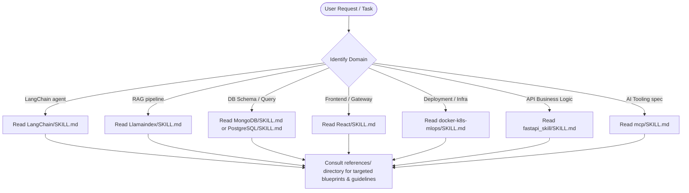

# Developer Skills Workspace

Welcome to the **Skills** workspace. This repository is a curated collection of structured blueprints, architect manuals, and reference patterns for 8 developer skills. It functions as both a personal reference center and a capability store for agentic development.

To make this page highly readable and interactive, we've organized the domain references inside collapsible blocks below. You can copy the code from this file directly into your Git repository's `README.md`.

---

## � Installing & Using the Skills

To "install" and use these custom skills in your developer environment or with your AI agents, follow these setup requirements and integration guidelines.

### 📋 Prerequisites & Requirements

- **Git**: Installed locally to clone and pull updates.
- **Markdown Viewer**: VS Code, Obsidian, or similar editor to read the blueprints.
- **AI Agent Hosts (Optional)**: Cursor, Claude Desktop, Claude Code, or a custom agentic framework.

---

### 1. Developer CLI Installation (Clone & Sync)

Clone this skill bank repository into your local workspaces folder to browse and references it offline:

```bash
# Clone the repository
git clone <your-repository-url>

# Navigate into the skills directory
cd skills
```

---

### 2. Installing in Cursor IDE

To make these skill manuals accessible to **Cursor's** LLM context:

1. **Workspace Docs Indexing**:
   - Open Cursor Settings (`Ctrl + ,` / `Cmd + ,`).
   - Navigate to **Features** > **Docs**.
   - Click **+ Add New Doc** and specify the path or remote URL to the respective skill files (e.g. pointing to `skills/LangChain/SKILL.md`).
2. **Using `.cursorrules`**:
   - Copy the markdown contents matching your current stack (e.g. `skills/React/SKILL.md`) directly into your project's `.cursorrules` file to restrict model outputs to these specifications.

---

### 3. Installing in Claude Desktop (via MCP Filesystem Server)

Allow **Claude Desktop** to search, locate, and read these detailed skill folders by mounting the directory as a local filesystem tool using the Model Context Protocol (MCP):

- Edit your `claude_desktop_config.json` configuration file:
  - **Windows**: `%APPDATA%\Claude\claude_desktop_config.json`
  - **Mac**: `~/Library/Application Support/Claude/claude_desktop_config.json`

- Add the filesytem server configuration block:

```json
{
  "mcpServers": {
    "local-skills-bank": {
      "command": "npx",
      "args": [
        "-y",
        "@modelcontextprotocol/server-filesystem",
        "E:/Projects/career_agent/skills"
      ]
    }
  }
}
```

- Restart Claude Desktop. The agent will now have a custom filesystem tool enabled to inspect search-matches in the manuals workspace.

---

### 4. Installing in Custom Agent Applications (LangChain / Python)

If you are developing a custom agent system (e.g. your own **Career Agent**), you can load these skill instructions dynamically during core execution.

- **Package Requirement**:
  ```bash
  pip install frontmatter langchain-community
  ```
- **Skill Loader Script**: Use this logic to parse skill directories, read frontmatter configuration tags, and inject them into system prompts:

  ```python
  import glob
  import frontmatter

  def load_agent_skills(skills_dir: str):
      skills_metadata = []
      # Scan every SKILL.md under subdirectories
      for skill_file in glob.glob(f"{skills_dir}/*/SKILL.md"):
          # Load YAML frontmatter metadata and body text
          post = frontmatter.load(skill_file)
          skills_metadata.append({
              "name": post.metadata.get("name", "Unknown Skill"),
              "description": post.metadata.get("description", ""),
              "path": skill_file,
              "content": post.content
          })
      return skills_metadata

  # Example: Load and select skill context matching user queries
  skills = load_agent_skills("./skills")
  print(f"Loaded {len(skills)} custom agent skills.")
  ```

---

## �🛠️ Technology Stack & Badges

Below are the main frameworks, languages, and tools documented across these developer skills:


---

## 📂 Directory Overview

```text
skills/
├── LangChain/            # LangChain v1 / LangGraph / Deep Agents (2026 Shift)
├── Llamaindex/           # Data Ingestion, Vector DBs, & Q&A RAG Pipelines
├── MongoDB/              # NoSQL Document Modeling, Aggregations, & Atlas Setup
├── PostgreSQL/           # SQL Fundamentals, Advanced Queries, & Operations
├── React/                # React + FastAPI AI UI/UX (Streaming, Agentic Panels)
├── docker-k8s-mlops/     # Containerization, Kubernetes Orchestration, & MLOps
├── fastapi_skill/        # High-performance FastAPI Backend Design & Auth
└── mcp/                  # Model Context Protocol (FastMCP Servers & Transports)
```

---

## 💡 Core Skills Summary

Here is a summary of each skill, including key packages, installation guidelines, and links to their entrypoint manuals:

| Skill               | Description                                                              | Primary Package / Install Command              | Entrypoint                                             |
| :------------------ | :----------------------------------------------------------------------- | :--------------------------------------------- | :----------------------------------------------------- |
| **LangChain**       | Modern LLM applications using LangChain v1, LangGraph, and Deep Agents.  | `pip install -U "langchain[anthropic]"`        | [LangChain/SKILL.md](LangChain/SKILL.md)               |
| **LlamaIndex**      | Lead connector framework for context-augmented Q&A/RAG pipelines.        | `pip install llama-index`                      | [Llamaindex/SKILL.md](Llamaindex/SKILL.md)             |
| **MongoDB**         | NoSQL document modeling, compound indexes (ESR), and aggregations.       | `npm install mongoose` / `pip install pymongo` | [MongoDB/SKILL.md](MongoDB/SKILL.md)                   |
| **PostgreSQL**      | Relational schemas, analytical window queries, CTEs, and `JSONB` data.   | `npm install pg` / `pip install psycopg`       | [PostgreSQL/SKILL.md](PostgreSQL/SKILL.md)             |
| **React + FastAPI** | AI UIs, Event Sources (SSE), websocket streaming, and proxy gateways.    | `npm install react react-dom`                  | [React/SKILL.md](React/SKILL.md)                       |
| **Docker + K8s**    | Multi-stage image builds, liveness/readiness probes, and GPU scheduling. | Install Docker Desktop / `kubectl`             | [docker-k8s-mlops/SKILL.md](docker-k8s-mlops/SKILL.md) |
| **FastAPI**         | Clean API design, Pydantic validation, dependency injection, and auth.   | `pip install fastapi "uvicorn[standard]"`      | [fastapi_skill/SKILL.md](fastapi_skill/SKILL.md)       |
| **MCP**             | Model Context Protocol spec (server tools, resources, and prompts).      | `pip install mcp` / `uv add "mcp[cli]"`        | [mcp/SKILL.md](mcp/SKILL.md)                           |

---

## 🔍 Detailed Skill Roundups & References

Click on any panel below to expand and view reference documents and installation steps.

<details>
<summary><b>1. LangChain Architect's Manual</b> (Click to expand)</summary>

- **Core Package**: `langchain` / `deepagents`
- **Installation**:
  ```bash
  pip install -U "langchain[anthropic]"
  pip install -U deepagents
  ```
- **Focus**: Replaces legacy `AgentExecutor` chains with middleware-extensible graph models using LangGraph and Deep Agents.
- **Key Reference Docs**:
  - [models.md](LangChain/references/MODELS.md) — Model initializations, streaming, and tool calling basics.
  - [agents.md](LangChain/references/AGENT.md) — Detailed configurations for single and multi-agent harnesses.
  - [memory.md](LangChain/references/MEMORY.md) — State management, checkpointers, and persistent session storage.
  - [middleware.md](LangChain/references/MIDDLEWARE.md) — Writing hooks to intercept tool execution and model requests.
  - [learning_path.md](LangChain/references/LearningPath.md) — Structured curriculum from beginner concepts to Production Graphs.
  </details>

<details>
<summary><b>2. LlamaIndex Architect's Manual</b> (Click to expand)</summary>

- **Core Package**: `llama-index`
- **Installation**:
  ```bash
  pip install llama-index
  ```
- **Focus**: Data indexing and query retrievers. Optimizes loading documents via parsers and building advanced indexing strategies.
- **Key Reference Docs**:
  - [rag_fundamentals.md](Llamaindex/references/rag_fundamentals.md) — Fundamental steps of retrieval-augmented generation.
  - [loading_and_nodes.md](Llamaindex/references/loading_and_nodes.md) — Schema parsing, Ingestion pipelines, and custom node splitters.
  - [indexing_and_embeddings.md](Llamaindex/references/indexing_and_embeddings.md) — Vector, Summary, and advanced PropertyGraph indices.
  - [vector_databases.md](Llamaindex/references/vector_database.md) — Integration configurations for databases like ChromaDB, Pinecone, and pgvector.
  - [workflows.md](Llamaindex/references/workflows.md) — Event-driven loops, step functions, and concurrency control.
  </details>

<details>
<summary><b>3. MongoDB Architect's Manual</b> (Click to expand)</summary>

- **Core Package**: `mongoose` (NodeJS) / `pymongo` (Python)
- **Installation**:
  ```bash
  npm install mongoose    # NodeJS Mongoose ODM
  pip install pymongo     # Python official driver
  ```
- **Focus**: Optimized JSON document storage. Prioritizes queries when designing database schemas.
- **Key Reference Docs**:
  - [data_modeling.md](MongoDB/references/data_modeling.md) — Decisions criteria on when to embed nested data vs. join collections.
  - [indexes.md](MongoDB/references/indexes.md) — Setup guidelines for compound indexes (ESR rules).
  - [aggregation.md](MongoDB/references/aggregation.md) — Pipeline architecture, stages usage, and indexing integrations.
  - [mongoose.md](MongoDB/references/mongoose.md) — Schema layers, validations, and custom model middleware in Express apps.
  </details>

<details>
<summary><b>4. PostgreSQL Architect's Manual</b> (Click to expand)</summary>

- **Core Package**: `pg` (Node) / `psycopg2` (Python)
- **Installation**:
  ```bash
  npm install pg          # Postgre driver for NodeJS
  pip install psycopg2    # Python driver
  ```
- **Focus**: Traditional relational mapping and SQL queries. Combines tabular schemas with hybrid unstructured columns.
- **Key Reference Docs**:
  - [datatypes_and_design.md](PostgreSQL/references/datatypes_and_design.md) — Structured schemas, identities, and `JSONB` documents.
  - [queries.md](PostgreSQL/references/queries.md) — Advanced analytics (window functions, subqueries, and CTE expressions).
  - [indexs_and_performance.md](PostgreSQL/references/indexs_and_performance.md) — B-trees, GIN indexes, and using `EXPLAIN ANALYZE` logs.
  - [transactions_and_concurrency.md](PostgreSQL/references/transactions_and_concurrency.md) — Row locking configurations and MVCC transactional states.
  </details>

<details>
<summary><b>5. React + FastAPI AI Application Manual</b> (Click to expand)</summary>

- **Core Package**: React Vite TS template & FastAPI server dependencies
- **Installation**:

  ```bash
  # Client project creation:
  npm create vite@latest my-ai-app -- --template react-ts
  cd my-ai-app && npm install

  # Backend project execution:
  pip install "fastapi[standard]" uvicorn python-multipart
  ```

- **Focus**: Structuring client-facing AI layouts. Develops clean event structures to display agent reasoning states.
- **Key Reference Docs**:
  - [streaming_and_llm_ui.md](React/references/streaming_and_llm_ui.md) — Client fetching protocols using SSE and WebSockets.
  - [chat_ui_patterns.md](React/references/chat_ui_patterns.md) — Rich text styling, scroll managers, and cancel hooks.
  - [agentic_ui_patterns.md](React/references/agentic_ui_patterns.md) — Interactive step logs, trace visualizations, and human-in-the-loop approvals.
  - [fastapi_ml_services.md](React/references/fastapi_ml_services.md) — Serving scikit-learn or PyTorch weight loads with FastAPI lifespans.
  </details>

<details>
<summary><b>6. Docker + Kubernetes MLOps Manual</b> (Click to expand)</summary>

- **Engine Tools**: Docker Engine / Docker Desktop / `kubectl` CLI tool
- **Configuration**: Follow official setup docs for container engines or package managers:
  - Download and install [Docker Desktop](https://www.docker.com/products/docker-desktop/) or Docker engine.
  - Install Kubernetes utilities: Minikube / Kind for local deployment, and `kubectl` orchestration CLI.
- **Focus**: Pipeline deployment. Coordinates scalable container layers for backend services and ML inference.
- **Key Reference Docs**:
  - [dockerfiles_for_ml.md](docker-k8s-mlops/references/dockerfiles_for_ml.md) — Multi-stage builds, dependencies caching, and image size constraints.
  - [probs_and_healing.md](docker-k8s-mlops/references/probs_and_healing.md) — Defining liveness/readiness thresholds to avoid weight loading timeouts.
  - [gpu_on_kubernetes.md](docker-k8s-mlops/references/gpu_on_kubernetes.md) — Device configurations, quotas scheduler, and node pools matching.
  - [cicd_and_gitops.md](docker-k8s-mlops/references/cicd_and_gitops.md) — Automatic rollback pipelines using GitOps operators.
  </details>

<details>
<summary><b>7. FastAPI Expert Mentor</b> (Click to expand)</summary>

- **Core Package**: `fastapi` & `uvicorn`
- **Installation**:

  ```bash
  pip install fastapi "uvicorn[standard]"

  # Full production/testing suite:
  pip install fastapi "uvicorn[standard]" sqlalchemy alembic pydantic-settings python-jose[cryptography] passlib[bcrypt] httpx pytest
  ```

- **Focus**: Reusable backend layout with clean validation. Built around Pydantic schema validation.
- **Key Reference Docs**:
  - [DATABASE.md](fastapi_skill/referencs/DATABASE.md) — SQLAlchemy connection pipelines, Session handlers, and Alembic migrations.
  - [Auth.md](fastapi_skill/referencs/Auth.md) — OAuth2 authentication setups, JWT generation, and password hashing guards.
  - [TEST.md](fastapi_skill/referencs/TEST.md) — Writing pytest fixtures with db overrides and async network mocks.
  - [DEPLOYMENT.md](fastapi_skill/referencs/DEPLOYMENT.md) — Gunicorn/Uvicorn configurations, Docker wrapping, and production logs setup.
  </details>

<details>
<summary><b>8. Model Context Protocol (MCP) Manual</b> (Click to expand)</summary>

- **Core Package**: `mcp` SDK / FastMCP wrappers
- **Installation**:

  ```bash
  pip install mcp

  # Or adding to a uv virtual project:
  uv add "mcp[cli]"
  ```

- **Focus**: Flexible client-server communication. Exposes local resources and actions cleanly to any AI host.
- **Key Reference Docs**:
  - [tools_resource_prompts.md](mcp/references/tools_resource_prompts.md) — Customizing entry parameters and return schemas.
  - [building_servers.md](mcp/references/building_servers.md) — Setup protocols using FastMCP wrapper decorators.
  - [transports.md](mcp/references/transports.md) — Standard input/output streams vs. remote HTTP and ASGI mount pathways.
  - [security.md](mcp/references/security.md) — Mitigating sandbox escalations, prompt injections, and token poisoning.
  </details>

---

## 🧭 How to Consult & Use the Skills

To query a specific skill or build a project using these guides, follow the standard workflow:



1. **Check the Entrypoint**: Start by reading the root `SKILL.md` of the relevant folder. It holds best practices, quick install setup commands, and a code stub.
2. **Follow the Routing Map**: Look at the table inside `SKILL.md` to find the exact reference file. For example, if you need help with **Pydantic Validation** in FastAPI, the route redirects you to `referencs/DATABASE.md`.
3. **Execute and Verify**: Test your implementations against the best practices summarized in each entrypoint, utilizing the learning paths to resolve any troubleshooting issues.
