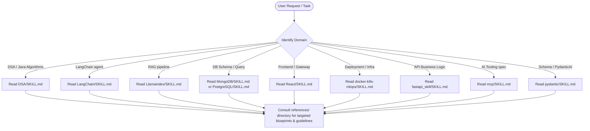

# Developer Skills Workspace

Welcome to the **Skills** workspace. This repository is a curated collection of structured blueprints, architect manuals, and reference patterns for 10 developer skills. It functions as both a personal reference center and a capability store for agentic development.

To make this page highly readable and interactive, we've organized the domain references inside collapsible blocks below. You can copy the code from this file directly into your Git repository's `README.md`.

---

## ⚡ Quick CLI Installation & Setup

You can install and deploy these skills directly to your coding environments (such as **Claude Code**, **Gemini CLI**, **Copilot**, **Cursor**, etc.) with zero dependencies using the matching `npx` command:

```bash
# Register skills inside Cursor (.cursorrules) or mount as Claude Desktop MCP filesystem server
npx developer-skills-bank
```

### What the installer handles:

- **Cursor IDE**: Automates copying specific skill files directly into a project's `.cursorrules` file or combines all skills into a single set of rules.
- **Claude Desktop**: Updates your local `claude_desktop_config.json` to auto-mount this entire skills directory as a filesystem MCP server, exposing all manuals as reference material for the LLM.
- **Claude Code / Gemini CLI / Copilot**: Instructs you on how to point these CLI runners to the skills folders or feed skill specs directly into current terminal sessions.

---

## 🛠️ Technology Stack & Badges

Below are the main frameworks, languages, and tools documented across these developer skills:


---

## 📂 Directory Overview

```text
skills/
├── DSA/                  # Data Structures & Algorithms in Java (Fundamentals to Advanced)
├── LangChain/            # LangChain v1 / LangGraph / Deep Agents (2026 Shift)
├── Llamaindex/           # Data Ingestion, Vector DBs, & Q&A RAG Pipelines
├── MongoDB/              # NoSQL Document Modeling, Aggregations, & Atlas Setup
├── PostgreSQL/           # SQL Fundamentals, Advanced Queries, & Operations
├── React/                # React + FastAPI AI UI/UX (Streaming, Agentic Panels)
├── docker-k8s-mlops/     # Containerization, Kubernetes Orchestration, & MLOps
├── fastapi_skill/        # High-performance FastAPI Backend Design & Auth
├── mcp/                  # Model Context Protocol (FastMCP Servers & Transports)
└── pydantic/             # Pydantic v2 Schema validation, Settings, & PydanticAI agents
```

---

## 💡 Core Skills Summary

Here is a summary of each skill and direct links to their entrypoint manuals:

| Skill               | Description                                                              | Entrypoint                                             |
| :------------------ | :----------------------------------------------------------------------- | :----------------------------------------------------- |
| **DSA (Java)**      | Complete manual for Data Structures & Algorithms (DSA) in Java.          | [DSA/SKILL.md](DSA/SKILL.md)                           |
| **LangChain**       | Modern LLM applications using LangChain v1, LangGraph, and Deep Agents.  | [LangChain/SKILL.md](LangChain/SKILL.md)               |
| **LlamaIndex**      | Lead connector framework for context-augmented Q&A/RAG pipelines.        | [Llamaindex/SKILL.md](Llamaindex/SKILL.md)             |
| **MongoDB**         | NoSQL document modeling, compound indexes (ESR), and aggregations.       | [MongoDB/SKILL.md](MongoDB/SKILL.md)                   |
| **PostgreSQL**      | Relational schemas, analytical window queries, CTEs, and `JSONB` data.   | [PostgreSQL/SKILL.md](PostgreSQL/SKILL.md)             |
| **React + FastAPI** | AI UIs, Event Sources (SSE), websocket streaming, and proxy gateways.    | [React/SKILL.md](React/SKILL.md)                       |
| **Docker + K8s**    | Multi-stage image builds, liveness/readiness probes, and GPU scheduling. | [docker-k8s-mlops/SKILL.md](docker-k8s-mlops/SKILL.md) |
| **FastAPI**         | Clean API design, Pydantic validation, dependency injection, and auth.   | [fastapi_skill/SKILL.md](fastapi_skill/SKILL.md)       |
| **MCP**             | Model Context Protocol spec (server tools, resources, and prompts).      | [mcp/SKILL.md](mcp/SKILL.md)                           |
| **Pydantic**        | Schema validation, settings management, and agentic workflows (PydanticAI).| [pydantic/SKILL.md](pydantic/SKILL.md)                 |

---

## 🔍 Detailed Skill Roundups & References

Click on any panel below to expand and view the reference blueprints and guidelines.

<details>
<summary><b>1. Data Structures & Algorithms (DSA in Java) Manual</b> (Click to expand)</summary>

- **Focus**: Complete guide to Data Structures and Algorithms conceptually and idiomatically in Java — from beginner fundamentals through FAANG-level problem solving.
- **Key Reference Docs**:
  - [java_fundamentals.md](DSA/references/java_fundamentals.md) — Java syntax, Collections Framework, generics, and Big-O notation.
  - [linear_structures.md](DSA/references/linear_structures.md) — Arrays, ArrayLists, LinkedLists, Stacks, and Queues.
  - [hashing.md](DSA/references/hashing.md) — HashTables, HashMap, HashSet, collision resolution, and custom keys.
  - [trees.md](DSA/references/trees.md) — Binary Trees, BSTs, AVL, Segment Trees, and tree traversals.
  - [graphs.md](DSA/references/graphs.md) — Adjacency lists/matrices, BFS, DFS, Dijkstra, Prim, and Kruskal.
  - [heaps.md](DSA/references/heaps.md) — PriorityQueue, Min-Heap, Max-Heap, and HeapSort.
  - [sorting_and_searching.md](DSA/references/sorting_and_searching.md) — QuickSort, MergeSort, Binary Search, and Two Pointers.
  - [recursion_and_backtracking.md](DSA/references/recursion_and_backtracking.md) — N-Queens, Subsets, Permutations, and recursive stack traces.
  - [dynamic_programming.md](DSA/references/dynamic_programming.md) — Memoization, Tabulation, 0/1 Knapsack, and LCS.
  - [greedy_algorithms.md](DSA/references/greedy_algorithms.md) — Activity Selection, Fractional Knapsack, and Huffman Coding.
  - [problem_solving_strategy.md](DSA/references/problem_solving_strategy.md) — Problem categorization, pattern recognition, and interview frameworks.
  - [learning_path.md](DSA/references/learning_path.md) — Step-by-step roadmap from beginner Java basics to FAANG-level problem solving.
</details>

<details>
<summary><b>2. LangChain Architect's Manual</b> (Click to expand)</summary>

- **Focus**: Replaces legacy `AgentExecutor` chains with middleware-extensible graph models using LangGraph and Deep Agents.
- **Key Reference Docs**:
  - [models.md](LangChain/references/MODELS.md) — Model initializations, streaming, and tool calling basics.
  - [agents.md](LangChain/references/AGENT.md) — Detailed configurations for single and multi-agent harnesses.
  - [memory.md](LangChain/references/MEMORY.md) — State management, checkpointers, and persistent session storage.
  - [middleware.md](LangChain/references/MIDDLEWARE.md) — Writing hooks to intercept tool execution and model requests.
  - [learning_path.md](LangChain/references/LearningPath.md) — Structured curriculum from beginner concepts to Production Graphs.
</details>

<details>
<summary><b>3. LlamaIndex Architect's Manual</b> (Click to expand)</summary>

- **Focus**: Data indexing and query retrievers. Optimizes loading documents via parsers and building advanced indexing strategies.
- **Key Reference Docs**:
  - [rag_fundamentals.md](Llamaindex/references/rag_fundamentals.md) — Fundamental steps of retrieval-augmented generation.
  - [loading_and_nodes.md](Llamaindex/references/loading_and_nodes.md) — Schema parsing, Ingestion pipelines, and custom node splitters.
  - [indexing_and_embeddings.md](Llamaindex/references/indexing_and_embeddings.md) — Vector, Summary, and advanced PropertyGraph indices.
  - [vector_databases.md](Llamaindex/references/vector_database.md) — Integration configurations for databases like ChromaDB, Pinecone, and pgvector.
  - [workflows.md](Llamaindex/references/workflows.md) — Event-driven loops, step functions, and concurrency control.
</details>

<details>
<summary><b>4. MongoDB Architect's Manual</b> (Click to expand)</summary>

- **Focus**: Optimized JSON document storage. Prioritizes queries when designing database schemas.
- **Key Reference Docs**:
  - [data_modeling.md](MongoDB/references/data_modeling.md) — Decisions criteria on when to embed nested data vs. join collections.
  - [indexes.md](MongoDB/references/indexes.md) — Setup guidelines for compound indexes (ESR rules).
  - [aggregation.md](MongoDB/references/aggregation.md) — Pipeline architecture, stages usage, and indexing integrations.
  - [mongoose.md](MongoDB/references/mongoose.md) — Schema layers, validations, and custom model middleware in Express apps.
</details>

<details>
<summary><b>5. PostgreSQL Architect's Manual</b> (Click to expand)</summary>

- **Focus**: Traditional relational mapping and SQL queries. Combines tabular schemas with hybrid unstructured columns.
- **Key Reference Docs**:
  - [datatypes_and_design.md](PostgreSQL/references/datatypes_and_design.md) — Structured schemas, identities, and `JSONB` documents.
  - [queries.md](PostgreSQL/references/queries.md) — Advanced analytics (window functions, subqueries, and CTE expressions).
  - [indexs_and_performance.md](PostgreSQL/references/indexs_and_performance.md) — B-trees, GIN indexes, and using `EXPLAIN ANALYZE` logs.
  - [transactions_and_concurrency.md](PostgreSQL/references/transactions_and_concurrency.md) — Row locking configurations and MVCC transactional states.
</details>

<details>
<summary><b>6. React + FastAPI AI Application Manual</b> (Click to expand)</summary>

- **Focus**: Structuring client-facing AI layouts. Develops clean event structures to display agent reasoning states.
- **Key Reference Docs**:
  - [streaming_and_llm_ui.md](React/references/streaming_and_llm_ui.md) — Client fetching protocols using SSE and WebSockets.
  - [chat_ui_patterns.md](React/references/chat_ui_patterns.md) — Rich text styling, scroll managers, and cancel hooks.
  - [agentic_ui_patterns.md](React/references/agentic_ui_patterns.md) — Interactive step logs, trace visualizations, and human-in-the-loop approvals.
  - [fastapi_ml_services.md](React/references/fastapi_ml_services.md) — Serving scikit-learn or PyTorch weight loads with FastAPI lifespans.
</details>

<details>
<summary><b>7. Docker + Kubernetes MLOps Manual</b> (Click to expand)</summary>

- **Focus**: Pipeline deployment. Coordinates scalable container layers for backend services and ML inference.
- **Key Reference Docs**:
  - [dockerfiles_for_ml.md](docker-k8s-mlops/references/dockerfiles_for_ml.md) — Multi-stage builds, dependencies caching, and image size constraints.
  - [probs_and_healing.md](docker-k8s-mlops/references/probs_and_healing.md) — Defining liveness/readiness thresholds to avoid weight loading timeouts.
  - [gpu_on_kubernetes.md](docker-k8s-mlops/references/gpu_on_kubernetes.md) — Device configurations, quotas scheduler, and node pools matching.
  - [cicd_and_gitops.md](docker-k8s-mlops/references/cicd_and_gitops.md) — Automatic rollback pipelines using GitOps operators.
</details>

<details>
<summary><b>8. FastAPI Expert Mentor</b> (Click to expand)</summary>

- **Focus**: Reusable backend layout with clean validation. Built around Pydantic schema validation.
- **Key Reference Docs**:
  - [DATABASE.md](fastapi_skill/referencs/DATABASE.md) — SQLAlchemy connection pipelines, Session handlers, and Alembic migrations.
  - [Auth.md](fastapi_skill/referencs/Auth.md) — OAuth2 authentication setups, JWT generation, and password hashing guards.
  - [TEST.md](fastapi_skill/referencs/TEST.md) — Writing pytest fixtures with db overrides and async network mocks.
  - [DEPLOYMENT.md](fastapi_skill/referencs/DEPLOYMENT.md) — Gunicorn/Uvicorn configurations, Docker wrapping, and production logs setup.
</details>

<details>
<summary><b>9. Model Context Protocol (MCP) Manual</b> (Click to expand)</summary>

- **Focus**: Flexible client-server communication. Exposes local resources and actions cleanly to any AI host.
- **Key Reference Docs**:
  - [tools_resource_prompts.md](mcp/references/tools_resource_prompts.md) — Customizing entry parameters and return schemas.
  - [building_servers.md](mcp/references/building_servers.md) — Setup protocols using FastMCP wrapper decorators.
  - [transports.md](mcp/references/transports.md) — Standard input/output streams vs. remote HTTP and ASGI mount pathways.
  - [security.md](mcp/references/security.md) — Mitigating sandbox escalations, prompt injections, and token poisoning.
</details>

<details>
<summary><b>10. Pydantic Architect's Manual</b> (Click to expand)</summary>

- **Focus**: Type-safe data validation, settings management, and AI agent development using Pydantic and PydanticAI.
- **Key Reference Docs**:
  - [validation_fundamentals.md](pydantic/references/validation_fundamentals.md) — BaseModels, field constraints, type coercion, and serialization.
  - [validators.md](pydantic/references/validators.md) — Custom field and model validators with before, after, and wrap modes.
  - [pydantic_ai_agents.md](pydantic/references/pydantic_ai_agents.md) — Type-safe AI agents with structured outputs, streaming, and multi-turn flows.
  - [tools_and_dependencies.md](pydantic/references/tools_and_dependencies.md) — Agent tools, typed dependency injection, RunContext, and retries.
  - [structured_outputs.md](pydantic/references/structured_outputs.md) — Validated LLM responses, validation retries, and output strategies.
  - [settings_management.md](pydantic/references/settings_management.md) — Environment variables loading and application configuration.
  - [learning_path.md](pydantic/references/learning_path.md) — Step-by-step track from basic schemas to production multi-agent systems.
</details>

---

## 🧭 How to Consult & Use the Skills

To query a specific skill or build a project using these guides, follow the standard workflow:



1. **Check the Entrypoint**: Start by reading the root `SKILL.md` of the relevant folder. It holds best practices, quick install setup commands, and a code stub.
2. **Follow the Routing Map**: Look at the table inside `SKILL.md` to find the exact reference file. For example, if you need help with **Pydantic Validation** in FastAPI, the route redirects you to `referencs/DATABASE.md`.
3. **Execute and Verify**: Test your implementations against the best practices summarized in each entrypoint, utilizing the learning paths to resolve any troubleshooting issues.
